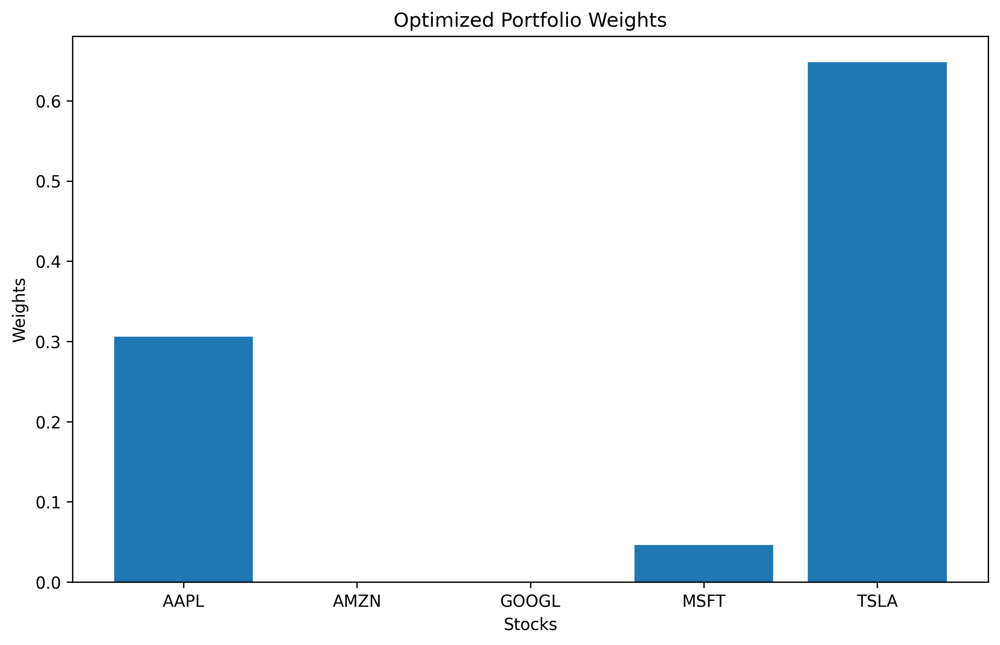

# Modern Portfolio Optimization Pipeline

An automated financial analysis tool built in Python to calculate optimal asset allocation weights using historical stock market data.

## Features
- **Data Pipeline**: Connects directly to Yahoo Finance to pull real-time historical data.
- **Risk Management**: Utilizes Ledoit-Wolf Shrinkage matrices to smooth statistical anomalies.
- **Mathematical Optimization**: Maximizes the Sharpe Ratio to find the optimal risk-to-reward balance.
- **Real-World Translation**: Converts theoretical percentages into concrete discrete share allocations based on your specific budget.
- **Visualization**: Generates custom asset distribution bar charts.

## Installation & Setup
To run this project locally, clone this repository and install the dependencies:
```bash
pip install -r requirements.txt
```

## Usage
Open the notebook in Google Colab or run your local Python script to execute the main engine:
1. Define your custom asset list (tickers).
2. Set your backtesting date range.
3. Inputs your total available investment budget.

## Visual Output Analysis

