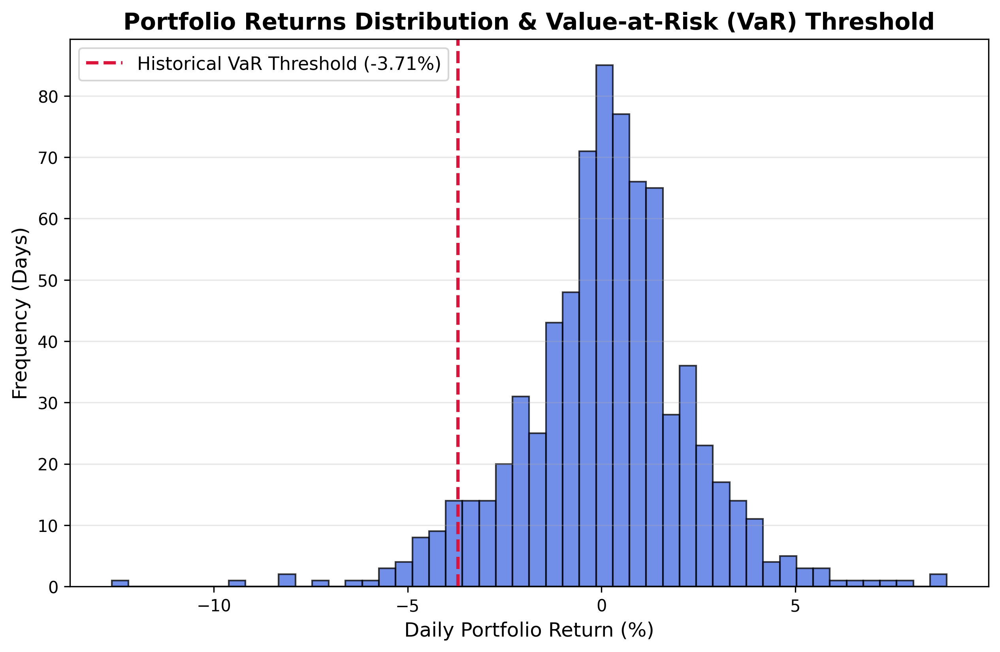

# Portfolio Value-at-Risk (VaR) Engine

This sub-module contains a production-ready risk analytics engine designed to evaluate the downside tail-risk of an equity portfolio. By translating raw asset returns into statistical risk metrics, this tool answers the core risk management query: *"What is the maximum expected loss on this capital allocation over a given time horizon at a specific confidence interval?"*

##Methodology: Historical Simulation (Non-Parametric)
Unlike parametric models that rely on rigid assumptions of a normal distribution (bell curve), this engine utilizes the **Historical Simulation method**. It captures empirical market truth by replaying actual historical market shocks, fat tails, and asset correlations present in the training timeframe.

##Features & Architecture
- **Automated Data Transformation**: Converts adjusted daily closing prices into stationary asset percentage return streams.
- **Dynamic Weight Integration**: Feature-engineered to map multi-asset weights from the portfolio optimization module dynamically, eliminating order mismatch errors.
- **Tail-Risk Isolation**: Computes the precise boundary cutoff point isolating the worst 5% (95% confidence) of historical trading outcomes.
- **Capital Exposure Quantification**: Maps fractional percentage volatility thresholds directly to absolute dollar exposure on a defined liquidity budget (e.g., $100,000 USD).
- **Statistical Visualization**: Automates the generation and saving of high-resolution return distributions and threshold markers.

##Code Structure
The implementation is built using production-grade, modular Python functions:
- `fetch_and_clean_returns()`: Handles data pipeline stream management and cleans empty trading days.
- `calculate_historical_var()`: Conducts matrix calculations (dot products) and handles percentile boundaries.
- `plot_var_distribution()`: Renders statistical frequency histograms of portfolio volatility profiles.

##Required Dependencies
- `yfinance`
- `pandas`
- `numpy`
- `matplotlib`

## Visual Output Analysis

